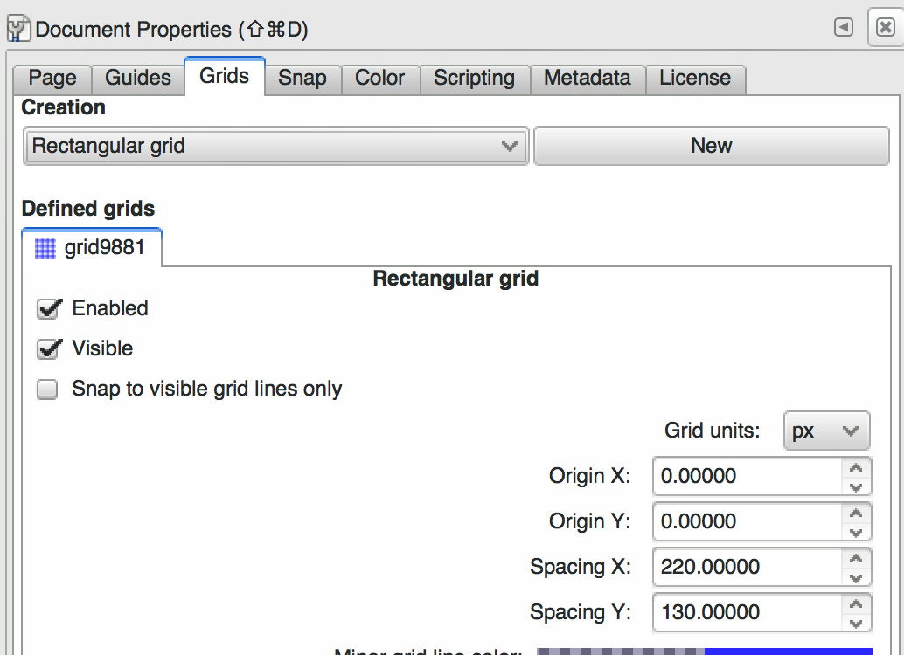
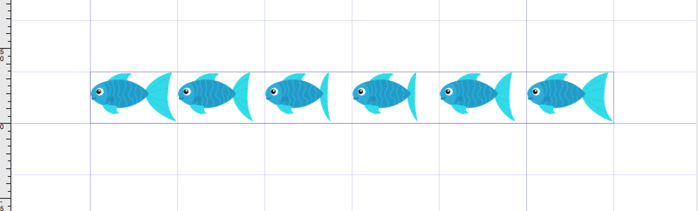
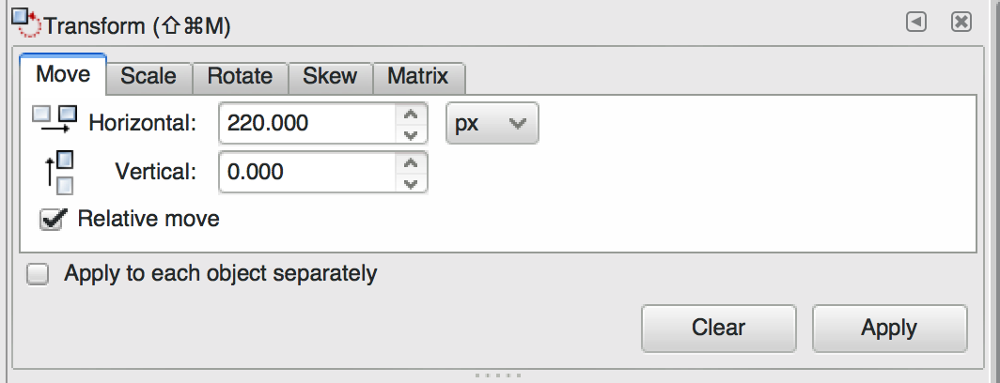
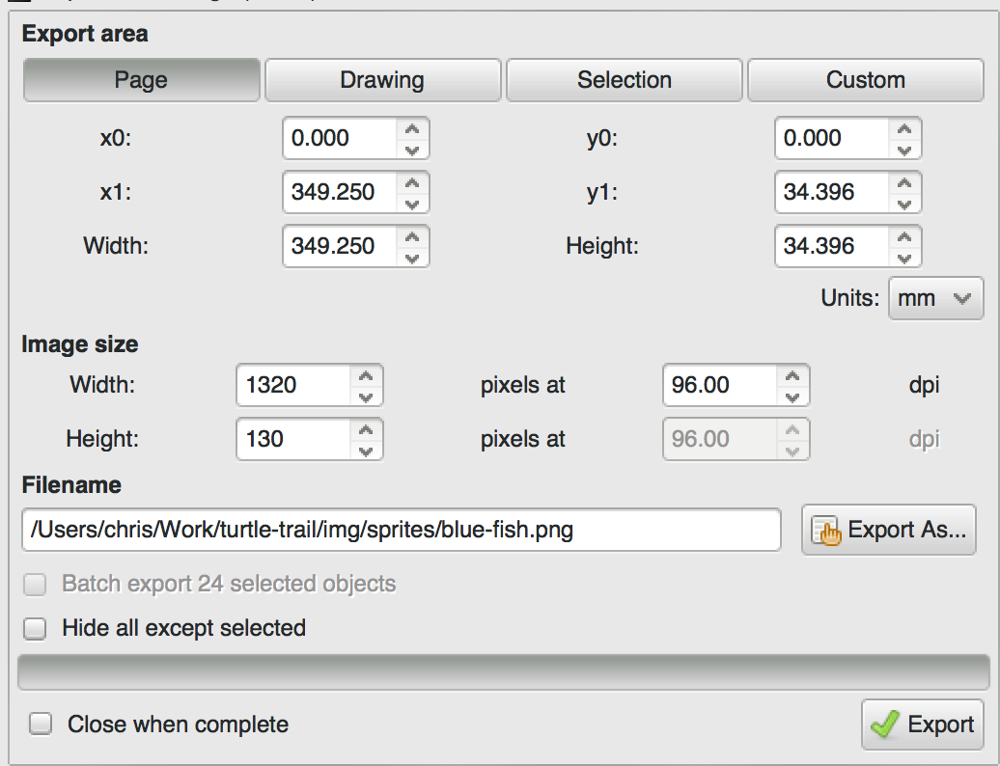

# sdl2-sprite

Create a horizontal sprite like this:


The size of the intended result image is 220x130, so provide that:

    sdl2-sprite blue-fish.png 220x130 --fps 15

This will open a window animating that sprite:


(Note: this is a screenflow recording of the animation manually edited
to repeat, so it's not as smooth as in reality.)

The animation repeats indefinitely at the desired framerate.

## Using Haskell API

Use `load` to load in a sprite for a `Renderer`:

``` haskell
load :: MonadIO m => Renderer -> FilePath -> V2 CInt -> m Sprite
```

To render the sprite at a given position use `render`:

``` haskell
render :: MonadIO m => Sprite -> V2 CInt -> m ()
```

To advance the sprite's frame to the next frame (or loop), use
`animate`:

``` haskell
animate :: Sprite -> Sprite
```

This is a pure function, so you can use it in a loop. See the source
in `app/Main.hs` of this repository for an example.


## How to make sprites in Inkscape

Choose the size of your intended result e.g. 220x130 and then setup
the grid in Inkscape to show that size (see the Spacing X/Spacing Y
fields):



It'll look like this, which is handy:



When you want to make a new frame, use `Ctrl-D` to duplicate the
selection and use the Transform tool to move it exactly 220 pixels to
the right and hit Apply.



Make sure that your document dimensions are your width x your frame
count.

Finally, export your image with the right "Image size" - make sure the
size is 130 so that the width scales right:



Now you're good to go! Hit Export.
