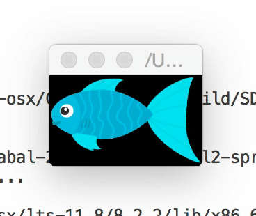

# sdl2-sprite

Create a horizontal sprite like this:

The size of the intended result image is 220x130, so provide that:

    sdl2-sprite blue-fish.png 220x130 --fps 15

This will open a window animating that sprite:

The animation repeats indefinitely at the desired framerate.
